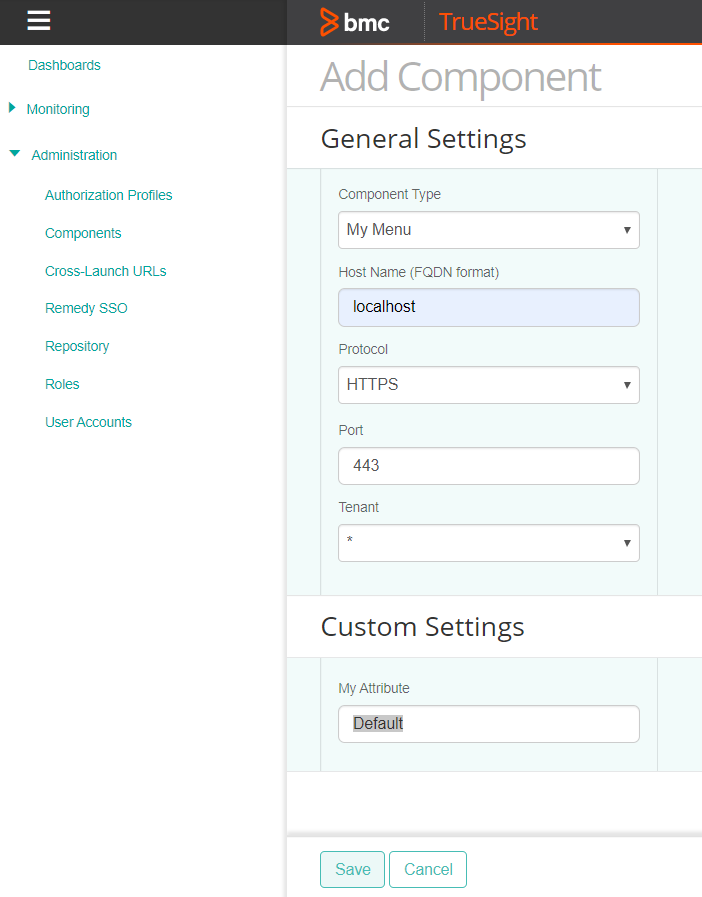

# Create New Menu for BMC TrueSight Presentation Server


A development guide showing how to create new *Menu* in BMC TrueSight Presentation Server. This project builds:

* A `my-menu-tsps-plugin-${project.version}.zip` plugin for TSPS, containing the **Menu Component**, which is a good start to create your own *menu*. This is a good example on how to extends the TSPS REST API and then use AngularJS and the TSPS frontend framework to display this data.


## Prerequisites

This repository is a multi modules Maven project that builds a plugin for BMC TrueSight Presentation Server.
To build it successfully, you need the following items:

* [OpenJDK 8, 9, or higher](//jdk.java.net/)
* [Maven 3.x](//maven.apache.org/download.cgi)
* [BMC TrueSight Presentation Server](//www.bmc.com/it-solutions/truesight-operations-management.html) (obviously)
* A good Java editor (like [Eclipse](//www.eclipse.org/downloads/))
* A good text editor (like [Atom](//atom.io/) or [Visual Studio Code](//code.visualstudio.com/download))
* Expertise
  * [Java](//www.w3schools.com/JAVA/) `*----`
  * [Maven](//maven.apache.org/guides/getting-started/maven-in-five-minutes.html) `*----`
  * [JavaScript](//www.w3schools.com/js/) `***--`
  * [AngularJS](//www.w3schools.com/angular/) `****-`
  * [HTML](//www.w3schools.com/html/), [CSS](//www.w3schools.com/css/) `**---`

## How to Build

In the project root directory, simply run:

```sh
$ mvn clean package
```

This will build `my-menu-tsps-plugin\target\my-menu-tsps-plugin-1.0.00-SNAPSHOT.zip`, which is the plugin to install in TSPS.

## How to Install

The first time, run the below command on the TSPS system, in the `/opt/bmc/TrueSightPServer/truesightpserver/bin` directory:

```sh
$ ./tssh componenttype add /tmp/my-menu-tsps-plugin-1.0.00-SNAPSHOT.zip
```

Once the plugin has been installed once, you will need to run the below command instead (`update` instead of `add`):

```sh
$ ./tssh componenttype update /tmp/my-menu-tsps-plugin-1.0.00-SNAPSHOT.zip
```

Note: The above examples assume the `my-menu-tsps-plugin\target\my-menu-tsps-plugin-1.0.00-SNAPSHOT.zip` file has first been copied to `/tmp` on the TSPS system.

TSPS is automatically restarted. Refresh your browser after a minute and your new *My Menu* component is now listed as available when creating or editing a *Component*! :-)



## The Internals

### The Build

This is a *Maven* project. If not familiar with *Maven*, we recommend [spending 5 minutes reading this](//maven.apache.org/guides/getting-started/maven-in-five-minutes.html), and maybe [some more time on this](//maven.apache.org/guides/getting-started/index.html).

The project has child modules, that need to be package in order to generate the final build `my-menu-tsps-plugin-1.0.00-SNAPSHOT.zip`

The *Maven* filtering is enabled on all resources included in the **.war** file and in the plugin. Files in the package notably leverage the **pom.xml** coordinates to prevent any conflict with other plugins and components that may be loaded in TSPS:

```xml
	<groupId>com.mycompany</groupId>
	<artifactId>my-menu</artifactId>
	<version>1.0.00-SNAPSHOT</version>
```

These coordinates **MUST** be changed to something relevant to your project and organization.

### How Things Run in the Back

When the plugin is installed in TSPS, it is loaded upon startup. The **.war** file is loaded and the *MyMenuApplication.contextInitialized()* method (which extends *ServletContextListener*) is executed.

This registers *AssetProvider* and *I18nProvider* instances. The *MyMenuAssetProvider* class declares the **.js** and **.css** files in the `my-menu-tsps-web/src/main/webapp` directory that need to be loaded in the user browser. The *MyMenuI18nProvider* class declares the `my-menu-tsps-web/src/main/resources/en.json` files, which contains the text resources in English.

The *MyMenuApplication.contextInitialized()* also registers the *MenuProvider* instance. The *MyMenuProvider* class declares the Menu hierarchy that needs to be displayed in TSPS when the application starts.

### How Things Run in the Front

When the browser loads the TSPS user interface, our **.js** and **.css** files get executed as well. The TSPS UI is developed with *AngularJS*.

Our **.js** code therefore needs to first declare an *AngularJS* module, and then configure the route to our Angular Component, i.e. `my-menu-devices-tsps` component.

The Angular Component **myMenuDevicesTsps** is responsible of rendering dom elements when the user clicks on My Menu -> Devices.

## The Files and Directories in this Project

| Directory | Description |
|---|---|
| **my-menu-tsps-lib**     | Contains minimal classes under `src/main/java/com/bmc/` that emulate the TSPS Java internal API so that our own code compiles properly **DO NOT MODIFY** |
| **my-menu-tsps-core**    | Defines the Java Class of the component *MyMenuComponent* which is located under `src/main/java/com/bmc`. A Jar for the current artifact will be built and then packaged into the **.zip** distribution |
| **my-menu-tsps-rest-api**| RESTEasy implementation example to extends the TSPS REST API. A jar will be built and then packaged into the **.zip** distribution |
| **my-menu-tsps-web**     | The Java code (in `src/main/java`) is compiled and bundled together with the content of `src/main/webapp` to build a .WAR file. This .WAR file is then packaged into a **.zip** file with the metadata necessary to declare a TSPS plugin.|
| **my-menu-tsps-plugin**  | Maven module responsible of packaging `my-menu-tsps-plugin-1.0.00-SNAPSHOT.zip` using Maven assembly descriptor for packaging the TSPS plugin (`dist.xml`). **DO NOT MODIFY**|
| **\*/target/**  | Maven build directory, where you'll find the plugin package  |
| **\*/.classpath**, **\*/.project**, **\*/.settings/**  | Eclipse stuff. Keep it if you use Eclipse.  |
| **\*/.github**, **\*/.gitignore**  | Git stuff. Keep it if you use Git (and why whouldn't you?).  |

## Where Do I Start?

### 1. Fork this Repository

First, you need to get the code.

Fork this repository (because you're not going to provide changes to **this** example, you'll develop your own stuff) and then clone it. If you're familiar with *Git* and *GitHub*, that will be easy enough.

Or you can simply download the source code from *GitHub* as an archive file that you uncompress on your system.

### 2. Modify the Project's Maven Coordinates

Modify **pom.xml** so that it reflects your project and organization (you're not working at *My Company*...):

```xml
	<groupId>com.mycompany</groupId>
	<artifactId>my-menu</artifactId>
	<version>1.0.00-SNAPSHOT</version>
```

Note: The *1.0.00-SNAPSHOT* version format is [common practice in Maven](//maven.apache.org/guides/getting-started/index.html#What_is_a_SNAPSHOT_version). You can however use any version format if you do not plan *deploying* the Maven artifact to a Maven repository.

### 3. Refactor the Java Classes

The Java code that ships with this template is placed in the following modules:

**my-menu-tsps-rest-api**

```java
package com.mycompany.mymenu.tsps;
```

**my-menu-tsps-core**

```java
package com.bmc.truesight.platform.etl.component.management.types
```

**my-menu-tsps-web**

```java
package com.mycompany.mymenu.tsps;
```

You need to change the Java package **AND** the directory structure to reflect your own project and organization (again, you're probably not working at *My Company*...). All references to the package in the Java source files must be updated accordingly.

It is important to change the package to something unique, that will not conflict with other Java classes loaded by TSPS.

Note: The package name does not need to strictly match with the Maven **pom.xml** coordinates.

You can use Eclipse to rename the package, change the directory structure and update all references accordingly, in a single operation.


### 4. Build

You can build the project by executing this command in the root directory of the project:

```sh
$ mvn clean package
```

Errors will be displayed clearly in the output of the Maven command and need to be fixed to get the TSPS plugin.

### 5. Install

**Only once the refactoring has been done**, you can install the new TSPS plugin in your TSPS environment with the commands described in the above section.

## Working with the AngularJS Front-End

**Warning! This part requires the most expertise.**

Note: Whenever you rename, delete or add files in the front-end, make sure that your *AssetProvider* Java class declares all the **.js** and **.css** files properly. Missing a **.js** file there may be the cause of lengthy head-scratching sessions!

### Menu routes

The *entry point* of our JavaScript code is **src/main/webapp/js/tsps-route.js** (that you may rename to your liking).

This file defines the route to our AngularJS component.

```js
(function() {
  // Define our AngularJS module
  angular.module("myMenuTspsApp", []);

  // Setup the AngularJS routes
  angular.module("myMenuTspsApp").config([
    "$stateProvider",
    "$urlRouterProvider",
    function($stateProvider, $urlRouterProvider) {
      $stateProvider.state("/my-menu/devices", {
        url: "/my-menu/devices",
        template: "<my-menu-devices-tsps></my-menu-devices-tsps>",
        permissions: "allow_uadmin_ui_login"
      });
    }
  ]);
})();

```

A few comments:

* The component **must** have a unique name to avoid conflicts with other existing components.
* The *template* fields are simple HTML fragment that leverage [AngularJS Components](//docs.angularjs.org/guide/component) that we detail below (`<my-menu-devices-tsps></my-menu-devices-tsps>`).
* You can declare several routes.

### Menu Component "my-menu-devices-tsps"

We decided to leverage [AngularJS Components](//docs.angularjs.org/guide/component) instead of [the traditional templates and controllers](//docs.angularjs.org/guide/concepts) that AngularJS developers are used to.

We have created one component `<my-menu-devices-tsps>`

  * declared in **src/main/webapp/components/my-menu-devices-tsps/my-menu-devices-tsps.js**
  * actual *Devices* page displayed in TSPS when the user selects My Menu -> Devices

When the component is initialized a HTTP GET on `/my-menu/devices` is executed in order to retireve data from the backend. The result is then set in `$ctrl.devices` and used by the **my-menu-devices-tsps.html** template.

```js
(function() {
  /**
   * <my-menu-devices-tsps> AngularJS component controller
   **/
  function dashboardMyMenuController($http) {
    var $ctrl = this;

    /**
     * $onInit
     **/
    $ctrl.$onInit = () => {
      $ctrl.deviceListPromise = $http.get("/tsws/10.0/api/my-menu/devices");

      $ctrl.deviceListPromise.then(response => {
        $ctrl.devices = response.data;
        $ctrl.deviceListFound = $ctrl.devices && $ctrl.devices.length > 0;
      });
    };
  }

  dashboardMyMenuController.$inject = ["$http"];

  angular.module("myMenuTspsApp").component("myMenuDevicesTsps", {
    controller: dashboardMyMenuController,
    templateUrl:
      "/my-menu-tsps-web/components/my-menu-devices-tsps/my-menu-devices-tsps.html",
    bindings: {}
  });
})();
```

### What Fancy Libraries Can I Use ?

TrueSight Presentation Server already loads a bunch of *JavaScript* libraries, so we encourage you **NOT** to add more third-party libraries as it would make the overall front-end application even heavier than what it already is.

Libraries already present in TSPS:

* [AngularJS 1.6.6](//code.angularjs.org/1.6.6/docs/api)
  * Including [ngAnimate](//code.angularjs.org/1.6.6/docs/api/ngAnimate), [ngResource](//code.angularjs.org/1.6.6/docs/api/ngResource), [ngTouch](//code.angularjs.org/1.6.6/docs/api/ngTouch), [ngSanitize](//code.angularjs.org/1.6.6/docs/api/ngSanitize), [ngCookies](//code.angularjs.org/1.6.6/docs/api/ngCookies), [UI Router](//ui-router.github.io)
* [UI Bootstrap](//angular-ui.github.io/bootstrap/)
* [jQuery 1.12.2](//api.jquery.com/)
* [jQuery UI 1.11.2](//jqueryui.com/)
  * Including core.js, widget.js, mouse.js, position.js, accordion.js, autocomplete.js, button.js, datepicker.js, dialog.js, draggable.js, droppable.js, effect.js, effect-blind.js, effect-bounce.js, effect-clip.js, effect-drop.js, effect-explode.js, effect-fade.js, effect-fold.js, effect-highlight.js, effect-puff.js, effect-pulsate.js, effect-scale.js, effect-shake.js, effect-size.js, effect-slide.js, effect-transfer.js, menu.js, progressbar.js, resizable.js, selectable.js, selectmenu.js, slider.js, sortable.js, spinner.js, tabs.js, tooltip.js
* [AmCharts v3](//www.amcharts.com/docs/v3/)
  * Including [AmBalloon](//www.amcharts.com/docs/v3/reference/amballoon/), [AmChart](//www.amcharts.com/docs/v3/reference/amchart/), [AmCoordinateChart](//www.amcharts.com/docs/v3/reference/amcoordinatechart/), [AmGanttChart](//www.amcharts.com/docs/v3/reference/amganttchart/), [AmGraph](//www.amcharts.com/docs/v3/reference/amgraph/), [AmLegend](//www.amcharts.com/docs/v3/reference/amlegend/) (not [I Am Legend](//www.imdb.com/title/tt0480249/)), [AmPieChart](//www.amcharts.com/docs/v3/reference/ampiechart/), [AmRectangularChart](//www.amcharts.com/docs/v3/reference/amrectangularchart/), [AmSerialChart](//www.amcharts.com/docs/v3/reference/amserialchart/), [AmSlicedChart](//www.amcharts.com/docs/v3/reference/amslicedchart/), [AmStockChart](//www.amcharts.com/docs/v3/reference/amstockchart/), [AmXYChart](//www.amcharts.com/docs/v3/reference/amxychart/), AmChart theme `light`
* [FileSaver.js](https://github.com/eligrey/FileSaver.js)
* [PDF Make](//pdfmake.org/#/)
* [JSZip](//stuk.github.io/jszip/)
* [SheetJS](//github.com/SheetJS/sheetjs)
* [jqWidgets](http://jqwidgets.com/)
  * Including [jqxScrollBar](//www.jqwidgets.com/jquery-widgets-documentation/documentation/jqxscrollbar/jquery-scrollbar-getting-started.htm?search=jqxScrollBar), [jqxDataTable](//www.jqwidgets.com/jquery-widgets-documentation/documentation/jqxdatatable/jquery-datatable-getting-started.htm?search=jqxDataTable), [jqxCheckBox](//www.jqwidgets.com/jquery-widgets-documentation/documentation/jqxcheckandradio/jquery-checkbox-getting-started.htm?search=jqxCheckBox), [jqxGrid](//www.jqwidgets.com/jquery-widgets-documentation/documentation/jqxgrid/jquery-grid-getting-started.htm?search=jqxGrid), [jqxMenu](//www.jqwidgets.com/jquery-widgets-documentation/documentation/jqxmenu/jquery-menu-getting-started.htm?search=jqxMenu), [jqxTree](//www.jqwidgets.com/jquery-widgets-documentation/documentation/jqxtree/jquery-tree-getting-started.htm?search=jqxTree), [jqxListBox](//www.jqwidgets.com/jquery-widgets-documentation/documentation/jqxlistbox/jquery-listbox-getting-started.htm?search=jqxListBox), [jqxDropDownList](//www.jqwidgets.com/jquery-widgets-documentation/documentation/jqxdropdownlist/jquery-dropdownlist-getting-started.htm?search=jqxDropDownList), [jqxTreeGrid](//www.jqwidgets.com/jquery-widgets-documentation/documentation/jqxtreegrid/jquery-treegrid-getting-started.htm?search=jqxTreeGrid), [jqxComboBox](//www.jqwidgets.com/jquery-widgets-documentation/documentation/jqxcombobox/jquery-combobox-getting-started.htm?search=jqxComboBox), [jqxSlider](//www.jqwidgets.com/jquery-widgets-documentation/documentation/jqxslider/jquery-slider-getting-started.htm?search=jqxSlider), [jqxTooltip](//www.jqwidgets.com/jquery-widgets-documentation/documentation/jqxtooltip/jquery-tooltip-getting-started.htm?search=jqxTooltip), [jqxSplitter](//www.jqwidgets.com/jquery-widgets-documentation/documentation/jqxsplitter/jquery-splitter-getting-started.htm?search=jqxSplitter)
* [Moment.js](//momentjs.com/)

## Removing a TSPS Plugin

Looks like someone installed a bad plugin in their TSPS environment!

Unfortunately, the `tssh` command does not allow you to **remove** component types (plugins). So, you will need to go manual.

Assuming you want to uninstall the **my-menu** plugin (we told you not to install it!), execute these commands (Linux) in the TSPS home directory (typically **/opt/bmc/TrueSightPServer/truesightpserver/**):

```sh
$ rm ./modules/tomcat/webapps/my-menu-tsps-web.war
$ rm -rf ./modules/tomcat/webapps/my-menu-tsps-web
$ rm -rf ./modules/tomcat/work/Catalina/localhost/my-menu-tsps-web
$ rm -rf ./componenttypes/my-menu-tsps-plugin
$ rm -rf ./componenttypes/my-menu-tsps*
$ rm ./lib/my-menu-tsps-*
$ rm ./logs/my-menu.log

```
